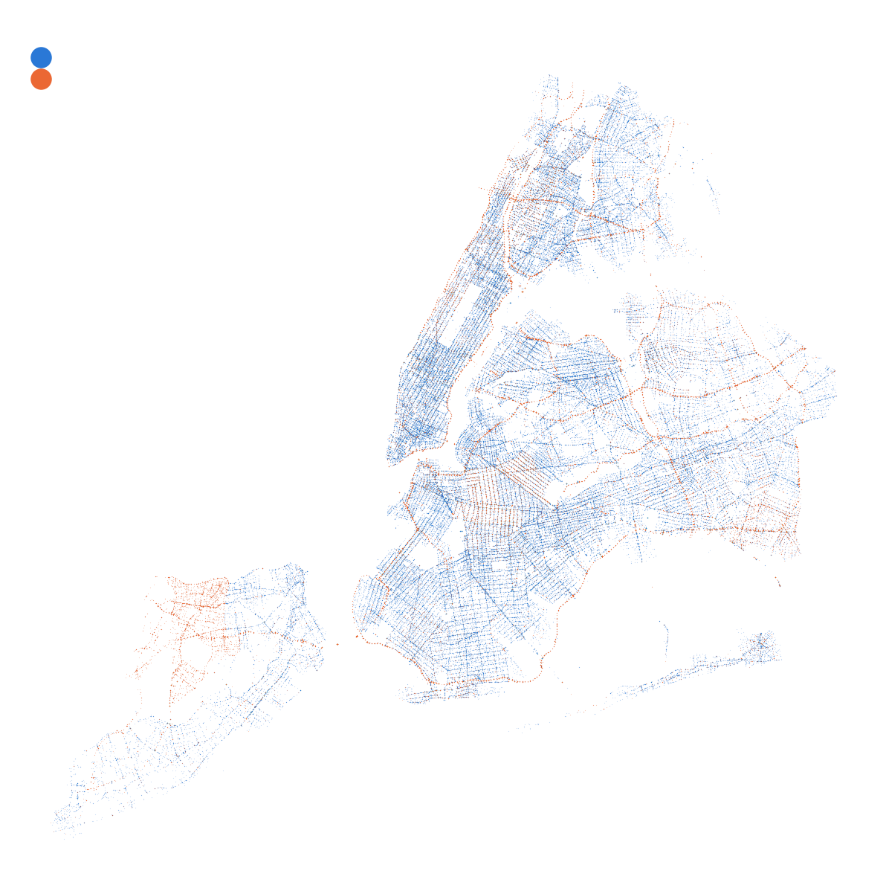

# NYC Auto Crash Risk: A Pricing-Style Frequency Study

*Police-reported crashes, 2023–2025. Orange = no borough recorded (mostly highways).*

## Question

How much does car crash risk differ across NYC's five boroughs and across times of day, once the number of vehicles per borough is accounted for, and how close can public data get to the rating an insurer would use?

## Data & exposure

I used NYC Open Data's police-reported crash records for 2023–2025 (273,469 crashes) and NYS DMV vehicle registrations (2,140,181 vehicles registered in the five boroughs with registrations expiring after 1/1/2026, excluding trailers) as exposure. About 27% of crashes had no borough, mostly on highways, plus a few neighborhoods where the borough wasn't recorded. Rather than dropping them, I allocated them to boroughs based on the percentage of registered cars attributed to each borough, and compared that to dropping them as a sensitivity check. I modeled crash counts by borough, time of day, weekday/weekend, and year with a Negative Binomial GLM, using registered vehicle-days (time when an accident is possible) as exposure.

## Findings

- Brooklyn vehicles have about 1.6× the crash rate of Queens (1.6–1.9× depending on how highway crashes are assigned); the Bronx about 1.5×; Staten Island about 0.6×.
- The evening rush (4–8 pm) is the riskiest time, about 1.15× midday. Night has 41% fewer crashes per hour, but night crashes are about 3× as likely to be fatal (5.5 vs. 1.8 deaths per 1,000 crashes).
- Crash counts varied about 70× more than Poisson allows, so a Negative Binomial model was needed for honest confidence intervals.

## Limitations

- **Crash location vs. garaging location.** Insurers rate by where a car is kept; however, this data records where crashes happen. This inflates Manhattan (1.9×, treated as an upper bound) because of higher activity, and it likely understates Queens in the same way.
- **No traffic volume:** time-of-day results reflect how many cars are on the road, not risk per mile.
- **Police-reported crashes only:** there could be a significant number of minor accidents that are not reported.
- **No claim dollars:** this measures how often crashes happen, not what they cost.

## What I'd do with insurer data

Use real exposure (car-years and miles driven), assign claims to the car's garaging address, model claim severity in dollars alongside frequency, add considerations for driver characteristics, and use credibility weighting so small groups lean on broader averages.

## Data

All data is free and public. The raw files are not included in this repository because of their size; follow the steps below to download them.

### 1. Crash records: NYC Open Data
**Source:** [Motor Vehicle Collisions – Crashes](https://data.cityofnewyork.us/Public-Safety/Motor-Vehicle-Collisions-Crashes/h9gi-nx95)

Every police-reported motor vehicle crash in NYC, one row per crash.

This export includes 487,914 crashes (2021–2025). The analysis uses **2023–2025: 273,469 crashes**.

**Columns used:** crash date and time, borough, latitude/longitude, on-street name, number of injured and casualties, contributing factor (vehicle 1), vehicle type (vehicle 1), collision ID.

### 2. Exposure: NYS DMV vehicle registrations
**Source:** [Vehicle, Snowmobile, and Boat Registrations](https://data.ny.gov/Transportation/Vehicle-Snowmobile-and-Boat-Registrations/w4pv-hbkt) 

Used as exposure: the number of registered vehicles in each borough.

**Filters applied** 
- **Record Type** = VEH (vehicles only; excludes boats and snowmobiles)
- **County** = Kings, Queens, New York, Bronx, Richmond (the five boroughs)
- **Reg Expiration Date** after 01/01/2026
- **Body Type** is not TRLR (excludes trailers, which can't crash on their own)

Then **Group and aggregate** by County, counting VINs. These counts are entered directly in the notebook, so this file does not need to be downloaded to run it.

| Borough | DMV county | Registered vehicles |
|---|---|---|
| Queens | Queens | 819,953 |
| Brooklyn | Kings | 530,238 |
| Staten Island | Richmond | 290,205 |
| Bronx | Bronx | 266,992 |
| Manhattan | New York | 232,793 |
| **Total** | | **2,140,181** |

### Data preparation notes
- **Missing borough:** 27% of 2023–2025 crashes have no borough recorded, mostly highway crashes plus a few neighborhoods where the borough wasn't recorded (see map). Instead of dropping them, they were allocated to boroughs in proportion to registered vehicles; dropping them is shown as a sensitivity check.
- **Map:** crashes without usable coordinates (about 7%) are excluded from the map only.
- **Insurance price comparison:** average full-coverage premiums by area from [Insurify](https://insurify.com/car-insurance/new-york/average-cost/) (updated August 2026), used only to compare with results and actual pricing.
